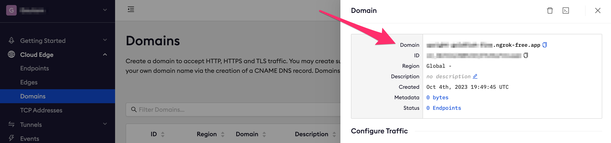
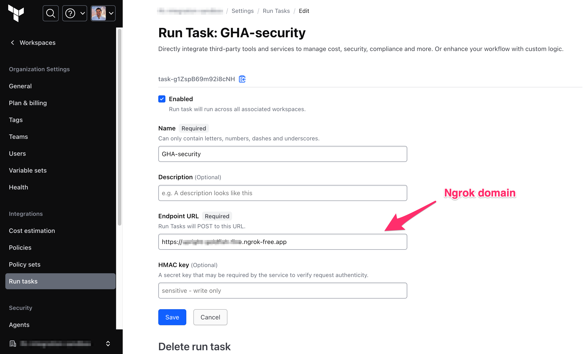

# sarif-to-terraform-runtask

[](https://github.com/gautambaghel/sarif-to-terraform-runtask/actions/workflows/linter.yml)
[](https://github.com/gautambaghel/sarif-to-terraform-runtask/actions/workflows/ci.yml)

This code converts SARIF results to structured Terraform Cloud run task outputs

## Getting started

This GitHub Action uses tunneling via NGROK to expose an endpoint for Terraform Cloud run tasks.

### Prerequisites

* A ngrok domain is required for the setup to work, this can be obtained by signing up for a [free account](https://dashboard.ngrok.com/signup)
  * 

* A workspace with the run task attached must exist in Terraform Cloud
  * 

---

> [!NOTE]
>
> You'll need to run ngrok and the server locally for the first time (**only once**) to verify run task

### Run this Action locally

This setup defaults the HMAC key to `abc123` & port to `3000` for using a different HMAC key set the `HMAC_KEY` and `PORT` env var respectively.

```sh
node src/index.js
```

---

```sh
ngrok config add-authtoken <your_token>
ngrok http --domain='<your_domain>' 3000
```

Create the run task with ngrok domain > save

## Usage

To include the action in a workflow in another repository, you can use the
`uses` syntax with the `@` symbol to reference a specific branch, tag, or commit
hash.

```yaml
steps:
  - name: Checkout
    id: checkout
    uses: actions/checkout@v4

  - name: Run my Action
    id: sarif-runtask-action
    uses: gautambaghel/sarif-to-terraform-runtask@v1
    with:
      ngrok_domain: ${{ secrets.NGROK_DOMAIN }}
      ngrok_authtoken: ${{ secrets.NGROK_TOKEN }}
      tfc_runtask_hmac_key: ${{ secrets.TFC_RUNTASK_HMAC }}
    env:
      PRISMA_CLOUD_URL: ${{ secrets.PRISMA_CLOUD_URL }} # required if using prisma cloud
      PRISMA_CLOUD_TOKEN: ${{ secrets.PRISMA_CLOUD_TOKEN }} # required if using prisma cloud
      SNYK_TOKEN: ${{ secrets.SNYK_TOKEN }}     # required if using snyk
```

### Building Setup locally

After you've cloned the repository to your local machine or codespace, you'll
need to perform some initial setup steps before you can develop your action.

1. :hammer_and_wrench: Install the dependencies

   ```bash
   npm install
   ```

2. :building_construction: Package the JavaScript for distribution

   ```bash
   npm run bundle
   ```

3. :white_check_mark: Run the tests

   ```bash
   $ npm test

   PASS  ./index.test.js
    index
      ✓ calls run when imported (2 ms)

   ...
   ```
